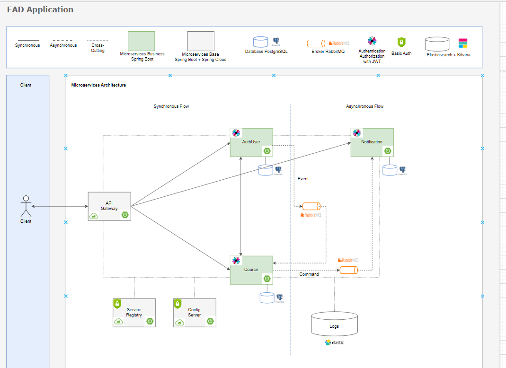

# EAD - API GATEWAY
## Sobre o projeto
Bem-vindo à Plataforma de Ensino EAD, esse projeto tem como objetivo oferece uma solução moderna para a gestão de ensino online.

Este projeto é uma prática dedicada à implementação dos principais padrões utilizados em microservices.

Cada funcionalidade da plataforma é abordada como um serviço independente, promovendo flexibilidade e isolamento de responsabilidades.

### Desenho da solução


## Sobre a API
Implementação do padrão API Gateway, tem como objetivo gerenciar e direcionar as solicitações de entrada para os microservices subjacentes. 
Funcionando como um ponto de entrada único para a arquitetura.

## Tecnologias utilizadas
- Java 11
- Spring boot
- Maven
- Eureka Client
- Spring Cloud Gateway

## Como executar o projeto
- Pré-requisitos: Java 11
- Ter os seguinte projetos em execução:
    - Service Registry
    - Config Server

```bash
# clonar repositório
git clone https://github.com/alinepazz/sistema-ead-microservice-api-gateway.git

# entrar na pasta raiz do projeto

# executar o projeto
mvn spring-boot:run
```
### Autor
Aline Soares da Paz

https://www.linkedin.com/in/alinepazz/

### Repositórios do projeto

- https://github.com/alinepazz/sistema-ead-microservice-configserver
- https://github.com/alinepazz/sistema-ead-microservice-api-configserver
- https://github.com/alinepazz/sistema-ead-microservice-api-registry
- https://github.com/alinepazz/sistema-ead-microservice-api-notification
- https://github.com/alinepazz/sistema-ead-microservice-api-course
- https://github.com/alinepazz/sistema-ead-microservice-api-authuser